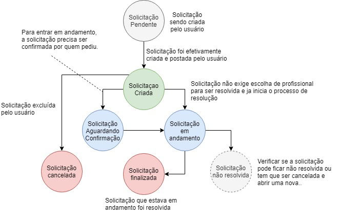
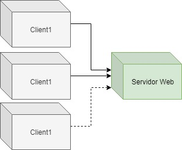
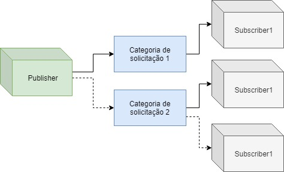

# Me Ensina Aí!

## Introdução:

O '**Me Ensina Aí!** é uma plataforma de ensino, em que os usuários poderão cadastrar dúvidas, solicitar ajudas para aprender determinado assunto além de receber tutorias de outros usuários.

A plataforma visa **interligar** **algúem** que **quer aprender** com pessoas que **querem ensinar**, como um fórum mais organizado e com possibilidade de envio de áudio e vídeo.

A ideia do projeto é a criação de um **MVP** (Mínimo Produto Viável) para a aplicação, contendo cadastro de usuários, cadastro de solicitações de ajuda, chat entre dois usuários com possibilidade de envio de áudio e vídeo, talvez chamada de vídeo futuramente. 

## Máquina de estados de uma solicitação:

## Arquitetura simplificada:

### Cliente Servidor
Os clientes vão ser navegadores dos celulares,de computadores, tablets.. E o servidor web pode ser algum da [AWS (Amazon Web Services)](https://aws.amazon.com/pt/).

### Publisher/Subscriber

>Pensei em implementar algo parecido com a biblioteca [SocketIO](https://socket.io/) para a comunicação em tempo real do chat feita entre os usuários em determinada sessão.

## Tecnologias envolvidas:

#### Front-End
- Html5, css e Javascript (ES6+)
- Uso do framework javascript [Sapper]([https://link](https://sapper.svelte.dev/docs/)) - o qual é baseado no [Svelte]([https://link](https://svelte.dev/)) - para a criação da web app (talvez PWA)

#### Back-End
- Para a construção do back-end será utilizado o ambiente de execução [NodeJS]((https://nodejs.org/en/))
- Implementação do socket e dos endpoints da API consumida.
#### Banco de dados
- **MongoDB** para armazenar informações relativas aos usuários do sistema, e  gravar as conversas de chat;

## Testes:
- **Testes das principais operações** envolvidas com os usuários, questionamentos e curtidas dos usuários na plataforma.
  > OBS: (Leitura, Criação, Deleção e Atualização) 

 

- **Teste de concorrência:** testar o acesso simultâneo de muitos usuários no sistema sem perda significativa de performance.
  
 

- **Teste de recuperação de falhas:** mostrar que caso ocorra um erro crítico e a aplicação parar de funcionar, o sistema deve ser capaz de voltar a execução de maneira amigável e não comprometedora a experiência do usuário.
  
 

- **Teste de carga:** fazer a verificação da quantidade de dados que o sistema consegue suportar
  > OBS: Verificar a quantidade de bytes que um navegador consegue armazenar ( usando localStorage, sessionStorage ou IndexedDB)

 

- **Teste de persistência de dados:** mostrar que as informações salvas serão mantidas mesmo após encerramento da sessão (fechamento do browser ou deslogar do sistema)
  > OBS: Analisar a questão do uso de cookies no site..

## Histórias dos usuários:
- Usuários podem se cadastrar na plataforma;
- Usuário pode cadastrar dúvidas/solicitações de ajuda;
- Usuário pode responder dúvidas após ser aceito para responder;
- Usuário pode responder uma única vez através de texto, vídeo ou áudio;
- Usuário pode solicitar uma ajuda/mentoria de outro usuário;
  

## Exemplificação:

Exemplos de atividades que poderão acontecer: 
  - Um **Desenvolvedor Senior** poderá entrar na plataforma e oferecer tutoriais para iniciantes em programação, recebendo ou não por isso.
  - Um **Estudante** de determinada matéria como Cálculo 2 poderá solicitar ajuda para resolver algum exercício.
  - Um **Estudante** da língua inglesa poderá receber materiais ou conversar com uma pessoa estrangeira.
  - Um **Profissional Free lancer** poderá entrar no sistema e realizar determinado serviço solicitado como criação de cartão de visita ou logo.

## Conclusão:
Futuramente a ideia do projeto é a construção de um **Uber de conhecimento** em que qualquer pessoa com capacidade de ensinar ou repassar conhecimento poderá entrar no sistema e ajudar a comunidade e poder receber pagamentos por ensinar. Dessa forma, usuários que solicitam ajuda podem escolher entre receber tutorias e ensinos de forma gratuita ou oferecer pagamentos.

> É importante destacar que na medida que pessoas contribuam no app, elas devem ganhar reputação seja através da gamificação da plataforma e avaliações pelos usuários que receberam auxílio.

